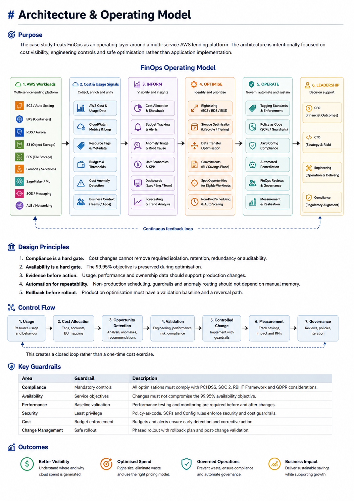
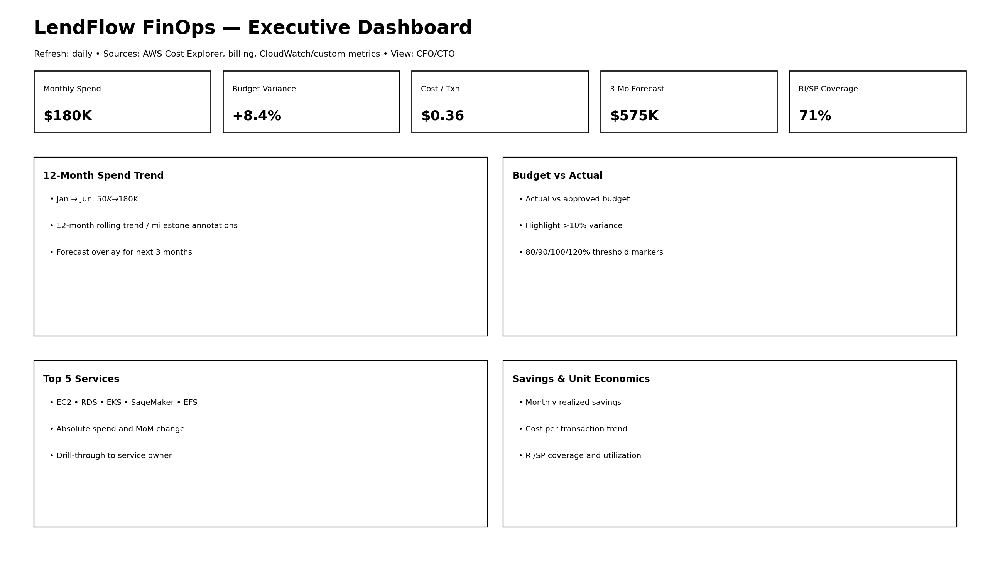
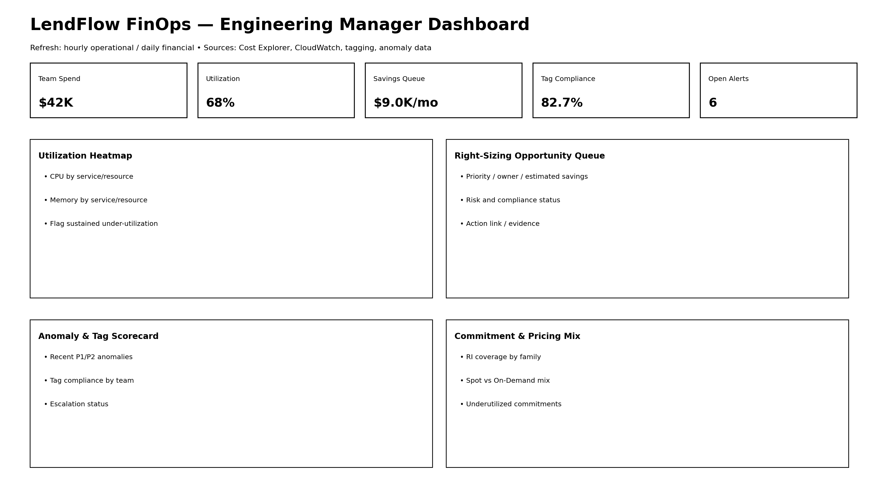
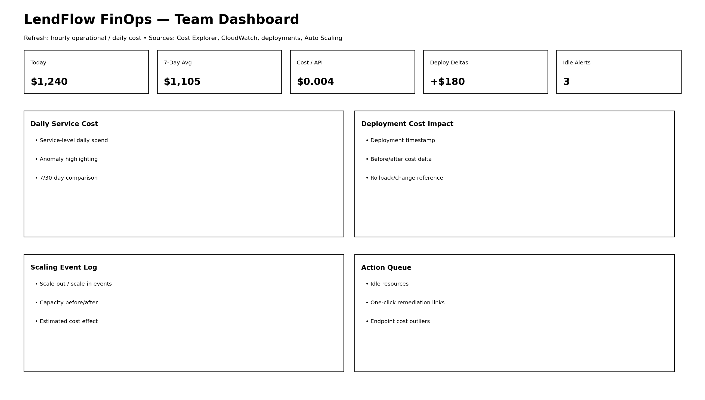

# LendFlow Technologies — FinOps Cost Optimisation

> A standalone AWS FinOps and Cloud Engineering case study covering cost analysis, optimisation, governance, automation and executive decision support using synthetic data.

---

## Project Overview

LendFlow Technologies is a fictional financial-services company operating a cloud-native lending platform on AWS.

This case study examines a rapid increase in AWS spending and develops an evidence-based FinOps strategy to improve cloud cost efficiency without compromising availability, performance, security or compliance.

The project demonstrates the engineering workflow from:

**Inform → Optimise → Operate**

It combines financial analysis with AWS engineering, infrastructure governance, automation, policy-as-code and executive decision support.

### Engineering status

This repository intentionally distinguishes analysis and design work from production implementation.

| Area | Status |
|---|---|
| Cost analysis | **Implemented against synthetic datasets** |
| Savings model | **Implemented** |
| EC2 right-sizing analysis | **Implemented** |
| Storage optimisation analysis | **Implemented** |
| Data-transfer analysis | **Implemented** |
| Database optimisation analysis | **Scenario analysis** |
| Cost anomaly analysis | **Implemented against synthetic events** |
| Terraform cost controls | **Reference implementation** |
| Infracost CI controls | **Reference implementation** |
| SCP controls | **Policy examples** |
| AWS Config controls | **Design/specification** |
| Automated remediation | **Architecture/design** |
| Autoscaling | **Policy design** |
| Dashboards | **Design/mockups** |
| Executive reporting | **Implemented as case-study artefact** |
| Production AWS deployment | **Not performed** |

## Architecture at a Glance


---
## Business Problem

LendFlow's AWS spend increased from approximately **$50,000/month in January 2026 to $180,000/month in June 2026** while business revenue approximately doubled.

The resulting cost trajectory created a financial-management problem:

- AWS spend increased significantly faster than business growth.
- The CFO required a **$60,000/month savings opportunity within 90 days**.
- The optimisation programme could not compromise the platform's availability or regulatory obligations.
- Engineering teams needed cost controls that could operate continuously rather than relying on periodic manual reviews.

The case study therefore treats cloud cost as an engineering and operating concern rather than simply a finance-reporting exercise.

---

## Objectives

The FinOps programme evaluates how to:

1. Establish reliable cloud-cost visibility.
2. Identify inefficient or unnecessary consumption.
3. Quantify optimisation opportunities without fabricating savings.
4. Improve cost allocation and ownership.
5. Introduce preventative and detective cloud-governance controls.
6. Automate appropriate remediation and scaling activities.
7. Provide engineering teams with actionable cost information.
8. Give leadership a clear view of savings confidence, risk and remaining gaps.
9. Maintain availability, security and compliance considerations throughout optimisation.

---

## Baseline

| Metric | Value |
|---|---:|
| January 2026 AWS spend | $50,000/month |
| June 2026 AWS spend | $180,000/month |
| Spend increase | 3.6× |
| CFO savings objective | $60,000/month |
| Expected modelled savings | **$51,677.71/month** |
| Expected annualised savings | **$620,132.52/year** |
| Worst-case modelled savings | $31,375.79/month |
| Best-case modelled savings | $53,903.64/month |
| Remaining gap to CFO target | **$8,322.29/month** |

The case study does **not** claim that the $60,000 target was achieved. The figures represent modelled opportunities based on the available synthetic evidence.

---

## FinOps Strategy

The project follows the FinOps lifecycle:

### Inform

Create visibility and accountability through:

- AWS cost analysis
- service-level spend analysis
- cost allocation
- tagging
- anomaly analysis
- dashboards
- budgets and thresholds
- unit-economic thinking

### Optimise

Evaluate engineering and commercial optimisation opportunities including:

- EC2 right-sizing
- storage lifecycle optimisation
- data-transfer reduction
- database optimisation scenarios
- Reserved Instances / Savings Plans
- Spot opportunities
- autoscaling
- non-production scheduling

### Operate

Prevent recurring waste through:

- governance
- ownership and RACI
- AWS Organizations controls
- SCPs
- AWS Config
- automated remediation design
- Terraform cost controls
- Infracost CI/CD integration
- anomaly escalation
- recurring FinOps reviews
- KPI and maturity tracking

---

## Cost Optimisation Opportunities

The strongest modelled opportunities are:

| Optimisation category | Expected monthly opportunity | Confidence / qualification |
|---|---:|---|
| Data-transfer optimisation | **$30,574.46** | Medium |
| EC2 right-sizing | **$9,032.50** | High |
| Storage optimisation | **$5,549.01** | High |
| Database optimisation | **$5,840.42** | Conditional |
| Spot opportunities | **$508.81** | Medium |
| RI / Savings Plans | **$172.51** | Conservative |
| **Expected modelled total** | **$51,677.71** | **Modelled** |

The database value uses the Aurora Serverless scenario in the expected model.

The alternative RDS right-sizing scenario is:

**$4,672.34/month**

These database scenarios are mutually exclusive and are not added together.

### Important financial distinction

The repository distinguishes between:

- observed spend
- identified optimisation opportunity
- modelled savings
- conditional scenarios
- planning assumptions
- realised savings

The figures above are **not realised production savings**.

---

## Savings Model

The expected savings position is:

```text
Current AWS spend             $180,000/month
CFO savings target             $60,000/month
Expected modelled savings      $51,677.71/month
Remaining gap                   $8,322.29/month
```

### Scenario range

```text
Worst case      $31,375.79/month
Expected        $51,677.71/month
Best case       $53,903.64/month
```

Annualised expected run-rate:

**$620,132.52/year**

Annual CFO target:

**$720,000/year**

The remaining gap is intentionally retained. The available evidence does not justify inventing additional savings simply to close the target.

See [`cost/savings-model.md`](cost/savings-model.md) for the financial model methodology and [`cost/savings-model.xlsx`](cost/savings-model.xlsx) for the supporting workbook.

---

## Governance & Controls

Cost optimisation is supported by preventative, detective and corrective controls.

### Cost allocation

The tagging strategy establishes ownership and allocation using mandatory dimensions such as:

- `business_unit`
- `product`
- `environment`
- `cost_centre`
- `team`

Additional tags can be applied where appropriate, including:

- `service`
- `created_by`
- `ttl`
- `compliance_scope`
- `data_classification`

### Budget governance

Budget controls use an escalation hierarchy:

**Organisation → Business Unit → Team → Project**

Budget thresholds include:

- 80% — awareness
- 90% — owner action
- 100% — escalation
- 120% — management escalation

### Policy controls

The policy layer includes examples for:

- approved AWS regions
- GPU-instance restrictions
- instance-count guardrails
- mandatory tagging
- AWS Config compliance rules
- Terraform tag validation
- oversized non-production instance controls
- CI/CD cost visibility

### Ownership

The governance model defines responsibilities across finance, technology, engineering, compliance, data and product stakeholders using RACI principles and recurring FinOps review cadences.

See [`finops/governance.md`](finops/governance.md) and [`policies/policy-controls.md`](policies/policy-controls.md).

---

## Automation

The case study applies automation where repeatable controls can reduce manual intervention.

### Cost-aware infrastructure workflow

```text
Developer
    │
    ▼
Terraform Pull Request
    │
    ▼
Terraform Plan
    │
    ▼
Infracost
    │
    ▼
Cost Delta / Threshold
    │
    ├── Within threshold ──────► Pass / Review
    │
    └── Above threshold ───────► Cost Review
```

### Automated governance

The proposed operating model includes:

- AWS Config detection
- Event-driven remediation
- safe auto-tagging where appropriate
- Slack/Jira notification integration
- recurring compliance reporting
- anomaly routing
- scheduled non-production scaling

Automation is designed with safety controls rather than assuming every detected violation should be remediated automatically.

Potential controls include:

- workload classification
- ownership validation
- exclusion/exception handling
- production safeguards
- approval requirements
- rollback procedures
- audit logging

See [`finops/automation.md`](finops/automation.md) and the executable/reference examples under [`policies/`](policies/).

---

## Dashboards


### Executive



### Engineering Manager



### Team



### Executive

Focuses on:

- current monthly spend
- budget versus actual
- historical spend trend
- cost per transaction
- top cost drivers
- month-over-month movement
- savings forecast
- RI/Savings Plans coverage
- anomaly impact
- savings target gap

### Engineering Manager

Focuses on:

- team/service spend
- utilisation
- right-sizing candidates
- tag compliance
- anomalies
- commitment utilisation
- Spot versus On-Demand opportunities
- engineering optimisation backlog

### Team

Focuses on:

- daily service cost
- deployment cost deltas
- scaling activity
- idle-resource indicators
- cost per endpoint
- anomalies
- actionable remediation items

See [`dashboards/dashboard-overview.md`](dashboards/dashboard-overview.md) and the editable Draw.io dashboards in [`dashboards/`](dashboards/).

---

## Executive Decision Support

The analysis is designed to help leadership answer:

- How large is the cost problem?
- What savings opportunities are credible?
- Which savings are high-confidence versus conditional?
- What engineering work is required?
- What risks accompany each recommendation?
- Which opportunities require further validation?
- How much of the CFO target remains unresolved?
- How should realised savings be measured after implementation?

The executive recommendation does not treat every identified opportunity as immediately realisable.

Instead, opportunities are assessed through:

**Savings → Confidence → Effort → Risk → Compliance → Validation → Realisation**

This provides a more defensible basis for CFO/CTO decision-making.

---

## Risk & Compliance

The fictional lending platform considers:

- PCI DSS
- SOC 2
- RBI IT Framework
- GDPR

These are treated as design constraints within the case study rather than claims of actual certification or compliance.

Examples of compliance-aware optimisation considerations include:

- preserving audit trails
- protecting sensitive workloads
- maintaining required redundancy
- avoiding unsafe data movement
- controlling resource creation
- maintaining appropriate isolation
- avoiding sensitive information in operational alerts

Cost reduction is therefore treated as subordinate to mandatory security, compliance and availability requirements.

---

## Engineering Decisions

Representative decisions include:

| Decision | Engineering rationale | Key trade-off |
|---|---|---|
| EC2 right-sizing | Reduce persistent unused capacity | Requires performance validation |
| Storage lifecycle optimisation | Move or expire ageing data appropriately | Data-access and retention requirements |
| Data-transfer optimisation | Reduce unnecessary network cost | Architecture and latency trade-offs |
| Spot for eligible workloads | Lower compute economics | Interruption handling required |
| Scheduled non-prod scaling | Remove predictable idle consumption | Requires reliable workload schedules |
| Database optimisation | Match capacity to workload behaviour | Requires workload/compatibility validation |
| SCP guardrails | Prevent undesirable resource configurations | Requires exception handling |
| Config + remediation | Detect policy drift | Automated changes require safety controls |
| Terraform + Infracost | Shift cost awareness into engineering workflow | Requires thresholds and governance |

See [`evidence/engineering-decisions.md`](evidence/engineering-decisions.md).

---

## Engineering Lessons

### FinOps is an engineering discipline as well as a financial discipline

Cloud cost is influenced directly by architecture, scaling, network topology, storage behaviour, workload patterns and infrastructure lifecycle.

### The cheapest architecture is not automatically the right architecture

An optimisation that reduces cost but damages availability, performance, security or compliance is not a successful optimisation.

### Cost awareness should move left

Terraform and CI/CD cost checks can expose financial impact before infrastructure reaches production.

### Governance prevents recurring waste

Finding an idle resource once is useful. Preventing the same class of waste from recurring is more valuable.

### Financial models need explicit assumptions

Where workload evidence is incomplete, the correct engineering response is to label a recommendation conditional rather than manufacture certainty.

### Realised savings require measurement

A modelled opportunity becomes a realised saving only after implementation, validation and measurement against an appropriate baseline.

---

## Limitations

This case study intentionally preserves the following limitations:

- All business and workload data is synthetic.
- The project does not represent a live LendFlow production environment.
- Some database optimisation decisions require workload telemetry that is not available in the synthetic dataset.
- RI/Savings Plans figures are planning assumptions and should be validated against current AWS pricing before procurement.
- Spot savings depend on workload suitability and interruption tolerance.
- Historical anomaly detection/response metrics such as actual MTTD cannot be calculated where detection and acknowledgement timestamps are unavailable.
- Some dashboard values are illustrative.
- Implementation costs and person-days are not claimed where reliable evidence was unavailable.
- Modelled savings should not be interpreted as guaranteed realised savings.
- Production deployment and production savings validation were not performed.

These limitations are intentional and are part of the engineering analysis rather than gaps hidden from the reader.

---

## What I Would Implement Next

If this case study were moved into a real AWS environment, the next engineering steps would be:

1. Connect the cost model to AWS billing/Cost and Usage data.
2. Map costs to real resource ownership and business dimensions.
3. Validate workload telemetry for database and compute decisions.
4. Deploy Terraform cost controls through CI/CD.
5. Enable AWS Config controls.
6. Implement EventBridge/Lambda remediation with production safeguards.
7. Integrate anomaly notifications with operational workflows.
8. Establish realised-savings measurement.
9. Track unit economics such as cloud cost per loan application.
10. Establish recurring FinOps operating reviews.

---

## Repository Structure

```text
.
├── architecture/
│   └── architecture-overview.md
│
├── cost/
│   ├── billing-analysis.xlsx
│   ├── cost-analysis.md
│   ├── roi-analysis.md
│   ├── savings-model.md
│   └── savings-model.xlsx
│
├── finops/
│   ├── anomaly-management.md
│   ├── automation.md
│   ├── governance.md
│   ├── policy-as-code-control-matrix.md
│   └── tagging-strategy.md
│
├── dashboards/
│   ├── dashboard-overview.md
│   ├── engineering-manager-dashboard-mockup.png
│   ├── engineering-manager-finops-dashboard.drawio
│   ├── executive-dashboard-mockup.png
│   ├── executive-finops-dashboard.drawio
│   ├── team-dashboard-mockup.png
│   └── team-finops-dashboard.drawio
│
├── policies/
│   ├── config-rules/
│   ├── remediation/
│   ├── scps/
│   ├── terraform-cost-aware/
│   └── autoscaling policies
│
├── evidence/
│   └── engineering-decisions.md
│
├── executive/
│   ├── cfo-review-panel.pptx
│   ├── decision-support.md
│   └── speaker-notes.md
│
├── analysis/
│   ├── cost analysis
│   ├── anomaly analysis
│   ├── optimisation analysis
│   ├── savings visualisations
│   └── supporting datasets
│
├── data/
│   ├── cost_anomaly_events.csv
│   ├── daily_cost_detail.csv
│   ├── data_transfer_log.csv
│   ├── instance_utilisation.csv
│   ├── monthly_cost_summary.csv
│   ├── reserved_instance_coverage.csv
│   ├── storage_inventory.csv
│   └── tag_compliance_report.csv
│
└── README.md
```

---

## Technologies

### AWS

- Amazon EC2
- Amazon EKS
- Amazon RDS
- Amazon Aurora
- Amazon S3
- Amazon EFS
- Amazon EBS
- Amazon VPC
- NAT Gateway
- Application Load Balancer
- AWS Lambda
- Amazon SQS
- Amazon SageMaker
- Amazon CloudWatch
- AWS Cost Explorer
- AWS Cost Anomaly Detection
- AWS Organizations
- Service Control Policies
- AWS Config

### Engineering

- Terraform
- Infracost
- CI/CD cost controls
- Policy-as-code
- Automated remediation design
- Autoscaling
- Scheduled scaling
- Predictive scaling

### Analysis & Documentation

- Python
- CSV
- Excel
- Draw.io
- PowerPoint
- Markdown
- Git
- GitHub

---

## Case Study Disclaimer

> **This is a fictional FinOps engineering case study using synthetic data. Financial figures, workloads, and business metrics are illustrative and are intended to demonstrate FinOps analysis, optimisation methodology, governance, automation design and executive decision-making. No production AWS environment, production cost reduction or realised financial saving is claimed.**

---

## Portfolio Focus

This case study demonstrates the intersection of:

**Cloud Engineering + DevOps + FinOps + Governance + Automation + Business Decision Support**

The objective is not simply to find cheaper AWS resources.

The objective is to demonstrate how an engineering organisation can understand cloud economics, identify defensible optimisation opportunities, introduce preventative controls, automate repeatable processes and give leadership enough evidence to make informed financial and technical decisions.
