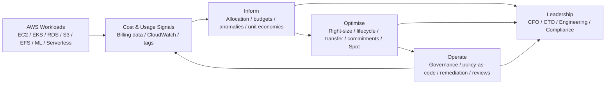

# Architecture & Operating Model

## Purpose

The case study treats **FinOps as an operating layer around a multi-service AWS lending platform**. The architecture is intentionally focused on cost visibility, engineering controls and safe optimisation rather than application implementation.

The operating model connects AWS workload telemetry and cost data to three FinOps activities:

- **Inform** — establish visibility, allocation, budgets, anomaly detection and unit economics.
- **Optimise** — identify, quantify and prioritise cost opportunities using engineering evidence.
- **Operate** — enforce governance, automate repeatable controls and measure realised outcomes.

## Operating Model



### Architecture Intent

| Layer | Purpose | Representative controls / outputs |
|---|---|---|
| **AWS Workloads** | Generate application, infrastructure and usage signals | EC2, EKS, RDS/Aurora, S3, EFS, Lambda, SageMaker, SQS, ALB |
| **Cost & Usage Signals** | Establish the evidence base for decisions | Billing data, CloudWatch metrics/logs, resource tags, budgets, anomaly signals |
| **Inform** | Turn raw spend into actionable financial and engineering insight | Cost allocation, budget tracking, anomaly triage, unit economics, dashboards |
| **Optimise** | Reduce waste without violating technical or regulatory constraints | Right-sizing, storage lifecycle, data-transfer optimisation, RI/Savings Plans, Spot, non-prod scheduling |
| **Operate** | Make cost management repeatable and governed | Tagging standards, SCPs, AWS Config, remediation, reviews and measurement |
| **Leadership** | Connect technical decisions to business outcomes | CFO financial outcomes, CTO strategy/risk, engineering delivery, compliance alignment |

## Design Principles

1. **Compliance is a hard gate.**  
   Cost changes cannot remove required isolation, retention, redundancy or auditability.

2. **Availability is a hard gate.**  
   The **99.95% availability objective** is preserved during optimisation.

3. **Evidence before action.**  
   Usage, performance and ownership data should support production changes.

4. **Automation for repeatability.**  
   Non-production scheduling, guardrails and anomaly routing should not depend on manual memory.

5. **Rollback before rollout.**  
   Production optimisation must have a validation baseline and a reversal path.

## Control Flow

```text
Usage
  ↓
Cost allocation
  ↓
Opportunity detection
  ↓
Validation
  ↓
Controlled change
  ↓
Measurement
  ↓
Governance
  ↺
Continuous feedback
```

This creates a **closed operating loop rather than a one-time cost exercise**.

### Control Gates

| Gate | Decision question |
|---|---|
| **1. Visibility** | Do we have reliable cost, usage and ownership evidence? |
| **2. Opportunity** | Is the waste or optimisation opportunity quantified? |
| **3. Validation** | Can the change meet performance, availability and compliance requirements? |
| **4. Controlled Change** | Is there an approved implementation and rollback path? |
| **5. Measurement** | Can savings, service impact and KPIs be measured after the change? |
| **6. Governance** | Does the result feed back into policy, budgets and future optimisation? |

## Key Guardrails

| Area | Guardrail | Application |
|---|---|---|
| **Compliance** | Mandatory controls | Optimisation must remain compatible with PCI DSS, SOC 2, RBI IT Framework and GDPR considerations. |
| **Availability** | Service objectives | Changes must not compromise the 99.95% availability objective. |
| **Performance** | Baseline validation | Performance testing and monitoring are required before and after production changes. |
| **Security** | Least privilege | Policy-as-code, SCPs and AWS Config controls provide security and cost guardrails. |
| **Cost** | Budget enforcement | Budgets and alerts provide early detection and support corrective action. |
| **Change Management** | Safe rollout | Production changes require validation, rollback planning and post-change measurement. |

## Optimisation Boundaries

The architecture separates **analysis and decision support** from direct application implementation.

### In Scope

- AWS cost and usage analysis
- Cost allocation and tagging strategy
- FinOps governance and operating cadence
- Right-sizing and storage optimisation analysis
- Data-transfer optimisation analysis
- Commitment and Spot purchasing scenarios
- Non-production scheduling strategy
- Policy-as-code examples and control design
- Anomaly detection and routing
- Dashboards and executive decision support

### Intentionally Out of Scope

- Application code implementation
- Production deployment
- Live AWS account changes
- Real production savings claims
- Changes that bypass compliance, availability or change-management controls

The savings figures in this case study are therefore **modelled scenarios based on synthetic data**, not claims of realised production savings.

## Outcomes

The intended operating outcomes are:

- **Better visibility** — understand where and why cloud spend is generated.
- **Optimised spend** — right-size resources, remove waste and select appropriate pricing models.
- **Governed operations** — prevent waste while maintaining security, compliance and operational controls.
- **Business impact** — translate engineering actions into measurable financial outcomes.

## Relationship to the Case Study

This architecture provides the operating context for the detailed cost analysis, savings model, governance controls, policy-as-code examples, dashboards and executive decision support contained in the repository.
